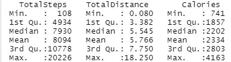
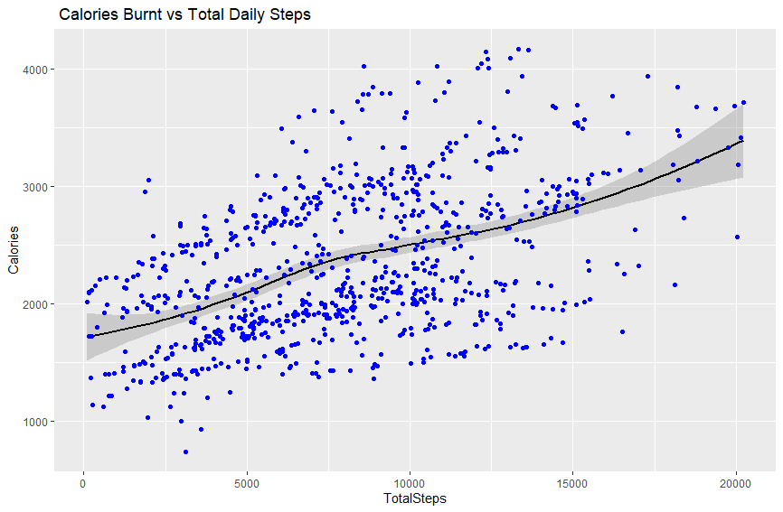
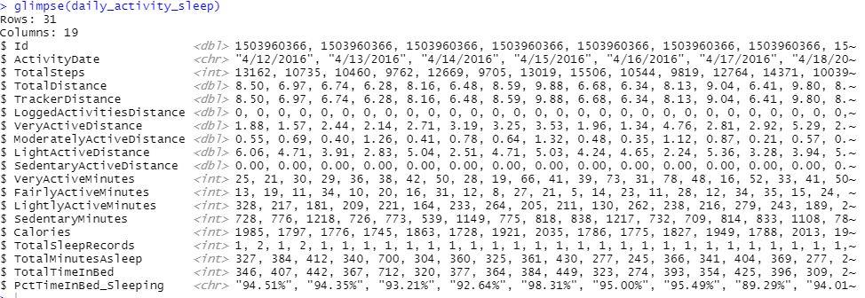
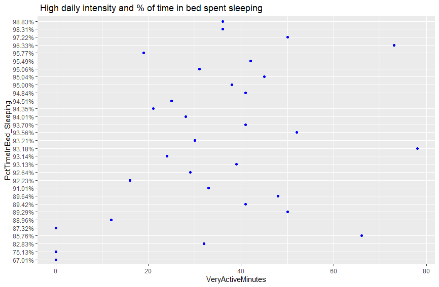
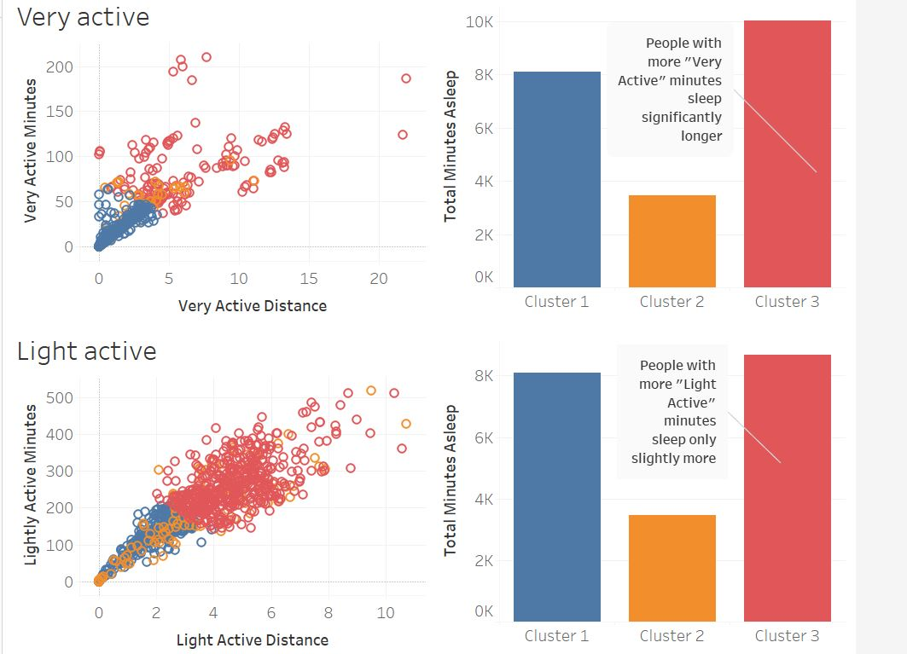
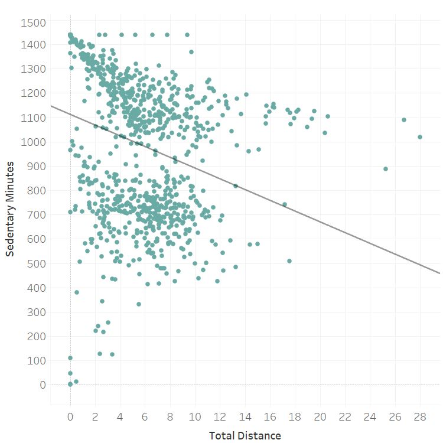

# Wellness Analysis
## How to improve Bellabeat? (Ask)
By answering these questions:
1. What are some trends in smart device usage?
2. How could these trends apply to Bellabeat customers?
3. How could these trends help influence Bellabeat marketing strategy?
## Data Preparation (Prepare)
The data was collected from [Kaggle](https://www.kaggle.com/arashnic/fitbit) From the user [Möbius](https://www.kaggle.com/arashnic).  
The data consists of personal fitness data taken from 30 *Fitbit* devices.  
It consists of Heart rate, sleep time, steps counter metrics.  

I first reviewed the .csv files that I wanted to analyze and checked for any missing values,  
and inconsistencies and corrected the formating of the dates.  
```{r}  
daily_activity <- read.csv("C:.../Fitabase Data 4.12.16-5.12.16/dailyActivity_merged.csv") 
daily_calories <- read.csv("C:.../Fitabase Data 4.12.16-5.12.16/dailyCalories_merged.csv") 
```
    
### Filter inaccurate data (Process)
I realized that there where many observations that were inaccurate due to a lack of device usage.  
As it is possible that people take less than 100 steps it is more likely that they haven't been using their device.  
I set the step minimum to 100 and the calorie minimum to 700 in order to use the most accurate data.  
```{r}
daily_activity <- filter(daily_activity, TotalSteps > 100)  
daily_calories <-  filter(daily_calories, Calories > 700)
```  
### Remove Outliers
There were some outliers in each dataset and I used the following code to filter them out.  
```{r}
calorie_outliers <- boxplot(daily_calories$Calories,plot=FALSE)$out  
daily_calories <- daily_calories[-which(daily_calories$Calories %in% calorie_outliers),]  
activity_outliers <- boxplot(daily_activity$TotalSteps, plot=FALSE)$out  
daily_activity<- daily_activity[-which(daily_activity$TotalSteps %in% activity_outliers),]
```  
### Align Column Names
In order to merge the two datasets together smoothly, I changed the column name for the dates so they will be identical.   
```{r}
daily_calories <- rename(daily_calories,ActivityDate=ActivityDay)
```  
### Merge Files
I then combined the two dataframes.  
```{r}
daily_activity_calories <- merge(daily_activity, daily_calories)
```  
### Summary of Data Used (Analyze)
This is some statistics of the combined dataframe:  
```{r}
daily_activity_calories %>%   
  select(TotalSteps,TotalDistance,Calories) %>%   
  summary()
```  

## Plot Graph (Share)
The following is a scatterplot overlaying a regression line to portray that the more steps taken the more calories you burn.  
```{r}
ggplot(data=daily_activity_calories, aes(x=TotalSteps, y= Calories, color = "red")) +   
  geom_smooth(method = "loess", color="black", formula = y ~ x)  + geom_point(color='blue')  +  
  labs(title = " Calories Burnt vs Total Daily Steps")
```    
  

What this graph shows is intuitive, the more a person walks the more calories they burn.  
The graph seems like it has a relatively low correlation, considering the fact that the two variables are highly associated.   
## Does being active help you sleep faster?
### Import new .csv
```{r}
daily_sleep <- read.csv("C:.../Fitabase Data 4.12.16-5.12.16/dailySleep_merged.csv")
```
### Align column names
Like previously I changed the columns to align.  
```{r}
daily_sleep <- rename(daily_sleep,ActivityDate=SleepDay)
```
### Merge Data
```{r}
daily_activity_sleep <- merge(daily_activity, daily_sleep,by=c('Id','ActivityDate'))
```
### Show Data

## Plot Data
I plotted the variables *VeryActiveMinutes* and *PctTimeInBed_Sleeping*.  
The first variable measures how much time a person spends doing rigoris activity.  
The second variable I created by dividing the time a person slept by the amount of time they spent in bed.  

```{r}
ggplot(data=daily_activity_sleep, aes(x=VeryActiveMinutes, y=PctTimeInBed_Sleeping , color = "red")) +
  geom_smooth(method = "loess", color="black", formula = y ~ x)  + geom_point(color='blue')  +  
  labs(title = " High daily intensity and % of time in bed spent sleeping")
```    
  
As you can see there is no specific pattern with activity and percent of time slept.  
It looks as if there is not enough data on sleep that overlaps with high activity.  
There is only 31 datapoints, which isn't enough to make any conclusions.  
  
I created an analysis that take a look at how much sleep (in minutes instead of percent like before).  
I created clusters based on activity, distance and sleep.  
We can see that in the *Very active* group the more active and further a person went the more sleep they got.  
While the *Light active* group only had a slight advantage in sleep time. 
  
I also wanted to show that contrary to what we may have thought, people that are more sedentary are not significantly less mobile.  
As we see there is only a slight slope and low correlation.  

## How to get more observations (Act)
We would have to figure out the reason people aren't using their device while asleep.  
There are a few reasons that come to mind.  
- People may not realize that it's meant for sleep
- Need to recharge
- Possible radiation
- Not clean (used during a workout)
- Not comfortable to sleep with  
We would have to figure out what the reason is and then we would be able to conclude a lot more  
about sleep and various activities once a conclusion is established these findings can be used for advertising purposes.  
For example if we see that more daily activity highly correlates with faster sleep times the bellabeat can use this data to incentivize using their device for exercise and track daily activities. 


